<p align="center">
  
</p>

<p align="center">
  
</p>

# CuraDesk AI – AI Powered Hospital Management System

## 🏥 About CuraDesk AI

CuraDesk AI is an advanced MERN-based Hospital Management System designed to streamline healthcare workflows through secure appointment management and AI-powered assistance.

The platform combines role-based healthcare management with intelligent medical AI features including OCR-powered report analysis, Retrieval-Augmented Generation (RAG), conversational memory, semantic search, and contextual AI assistance.

Built for portfolio-grade full stack and AI engineering demonstration.

<p align="center">


</p>

## 🚀 Features

👨‍💼 Admin Panel

-	Add, edit, and manage doctors & services
-	View, reschedule, or cancel appointments
-	Update appointment status (Pending, Confirmed, Completed, Cancelled)
-	Track earnings and bookings
-	Dark mode enabled dashboard 🌙

 🩺 Doctor Panel

-	View assigned appointments
-	Update appointment status
-	Manage patient interactions

 🧑 Patient Panel

-  Register/Login securely (Clerk Auth)
-  Book appointments with doctors/services
-  View appointment history
-  🤖 AI Symptom Chatbot for smart doctor recommendations
-  📄 AI Medical Report Upload & Analysis
-  🧠 RAG-based Medical Report Question Answering
-  🔍 Semantic Search using Vector Embeddings


## ✨ Core Functionalities

-	🔐 Role-based Authentication (Admin / Doctor / Patient)
-	📅 Appointment Scheduling System with status tracking
-	💳 Online Payments using Stripe (secure checkout & auto-confirmation)
-	📧 Email Notifications (Nodemailer) for booking updates
-	🤖 Chatbot Integration for guided doctor booking
-   🧠 AI-Powered RAG (Retrieval-Augmented Generation) System
-   📄 PDF Medical Report Upload & Text Extraction
-   🔍 Semantic Search using ChromaDB Vector Database
-   ⚡ Redis-based Chat Memory & Caching
-   🐳 Dockerized AI Infrastructure (Redis + ChromaDB)
-   🤖 AI Report Assistant for contextual report querying
-	🌙 Dark Mode Support (Admin Panel)
-	🖼️ Image Uploads via Cloudinary
-	⚡ Responsive UI built with React + Tailwind CSS
-	🔒 Protected Backend APIs & Middleware Security
-   🧠 Persistent AI conversational memory
-   📑 Multi-page PDF report understanding
-   🧹 Frontend-only chat clearing & expiry
-   ♻️ Report hash reuse & vector reuse optimization


## 🛠️ Tech Stack

 Frontend:

-	React.js (Vite)
-	Tailwind CSS
-	Context API

 Backend:

-	Node.js
-	Express.js

 Database:

-	MongoDB (Mongoose)

 Authentication:

-	Clerk

 Integrations:

-	Stripe (Payments)
-	Cloudinary (Image Uploads)
-	Nodemailer (Emails)
-   Gemini AI (LLM + Embeddings)
-   ChromaDB (Vector Database)
-   Redis (Caching & Session Memory)
-   Docker & Docker Compose
-   PDF2JSON (PDF Parsing)

## 🏗️ System Architecture

```txt
React Frontend
        ↓
Express Backend
        ↓
MongoDB + Clerk + Cloudinary
        ↓
AI Layer
(Gemini + OCR + ChromaDB + Redis + RAG)
```

## 🧠 AI Architecture

The project includes an advanced AI-powered healthcare assistant system.

## 🧠 Conversational Memory System

CuraDesk AI includes persistent conversational memory.

Features:

- Chat history stored securely
- Memory restored after chatbot reopening
- Context-aware follow-up conversations
- Frontend-only chat expiry (1 hour)
- User-side "Clear Chat" option
- Database memory preserved for system intelligence and analytics

### AI Features

- Symptom-based doctor recommendation chatbot
- AI-powered medical report upload & analysis
- Multi-page PDF extraction
- OCR-powered text recognition (Tesseract)
- Retrieval-Augmented Generation (RAG)
- Semantic similarity search
- ChromaDB vector retrieval
- Redis-based caching
- Persistent conversational memory
- Context-aware follow-up conversations
- Chat history restoration
- Frontend-only privacy-based memory expiry
- User-side clear chat functionality

### AI Pipeline

```txt
PDF Upload
   ↓
Text Extraction
   ↓
OCR + Cleaning
   ↓
Chunking
   ↓
Gemini Embeddings
   ↓
ChromaDB Storage
   ↓
Semantic Retrieval
   ↓
AI-Powered Question Answering
```


## 📦 Project Structure

```bash
root/
│
├── admin/            # Admin dashboard (React + Vite)
│   └── src/
│       ├── components/
│       ├── pages/
│       └── context/
│
├── frontend/         # Patient & Doctor frontend
│   └── src/
│       ├── components/
│       ├── pages/
│       └── doctor/
│
├── backend/          # Node.js + Express API
│   ├── controllers/
│   ├── routes/
│   ├── models/
│   ├── middlewares/
│   ├── services/
│   ├── utilities/
│   └── config/
```


## ⚙️ Installation & Setup

 1️⃣ Clone Repository

	git clone https://github.com/tyagi1tushar/curadesk-hospital-management-system.git
	
	cd hospital-management-system
	
 2️⃣ Backend Setup

	cd backend
	
	npm install

Create .env file:

	MONGO_URI=your_mongodb_uri
	CLERK_SECRET_KEY=your_clerk_secret
	STRIPE_SECRET_KEY=your_stripe_secret
	CLOUDINARY_CLOUD_NAME=your_cloud_name
	CLOUDINARY_API_KEY=your_api_key
	CLOUDINARY_API_SECRET=your_api_secret
	EMAIL_USER=your_email
	EMAIL_PASS=your_email_app_password
	GEMINI_API_KEY=your_gemini_api_key

Run backend:

	npm start
	
 2️⃣ Start AI Infrastructure

 Make sure Docker Desktop is running.

Run:

```bash
docker-compose up 


 3️⃣ Frontend Setup

Patient/Doctor Frontend

	cd frontend
	npm install
	npm run dev

Admin Panel

	cd admin
	npm install
	npm run dev

## 🔄 Workflow Overview

1.	Patient selects doctor/service
2.	Books appointment
3.	Completes Stripe payment
4.	Appointment automatically marked as Confirmed
5.	Email notification sent to patient

## 🤖 AI Report Workflow

1. User uploads medical PDF report
2. Backend extracts and cleans text
3. Text is chunked into semantic sections
4. Gemini generates vector embeddings
5. Embeddings stored inside ChromaDB
6. User asks questions about report
7. RAG pipeline retrieves relevant chunks
8. AI assistant responds contextually


## 📸 Screenshots

### 🧑‍💻 User Experience

<table>
<tr>
<td align="center">

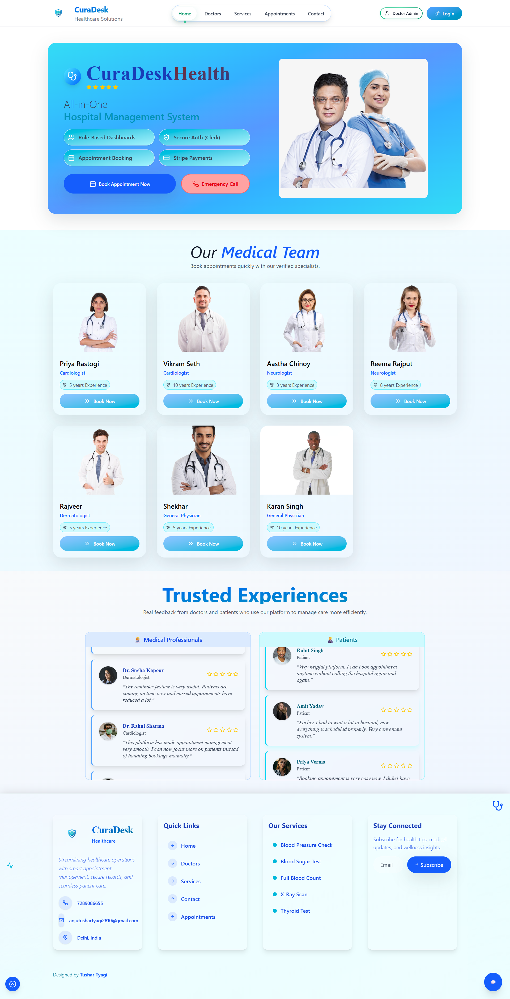
<br/>
<b>User Dashboard</b><br/>
Overview of user activity and appointments

</td>

<td align="center">

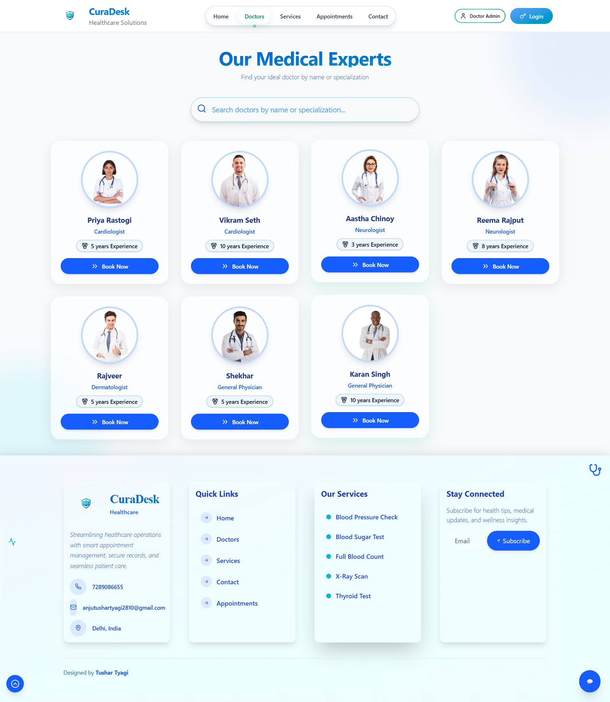
<br/>
<b>Booking System</b><br/>
Book appointments with doctors/services

</td>
</tr>

<tr>
<td align="center">

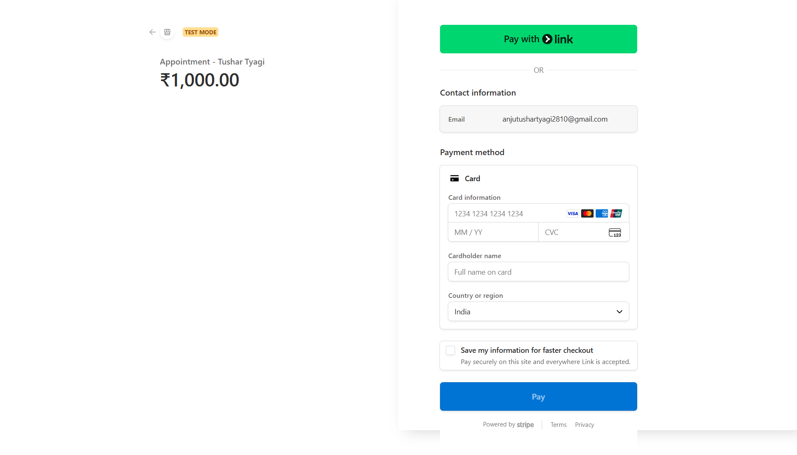
<br/>
<b>Payment Flow</b><br/>
Secure Stripe checkout experience

</td>

<td align="center">

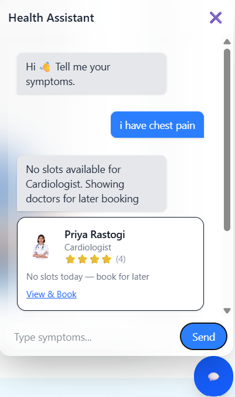
<br/>
<b>AI Chatbot</b><br/>
Helps users discover suitable doctors

</td>
</tr>

<tr>
<td align="center">

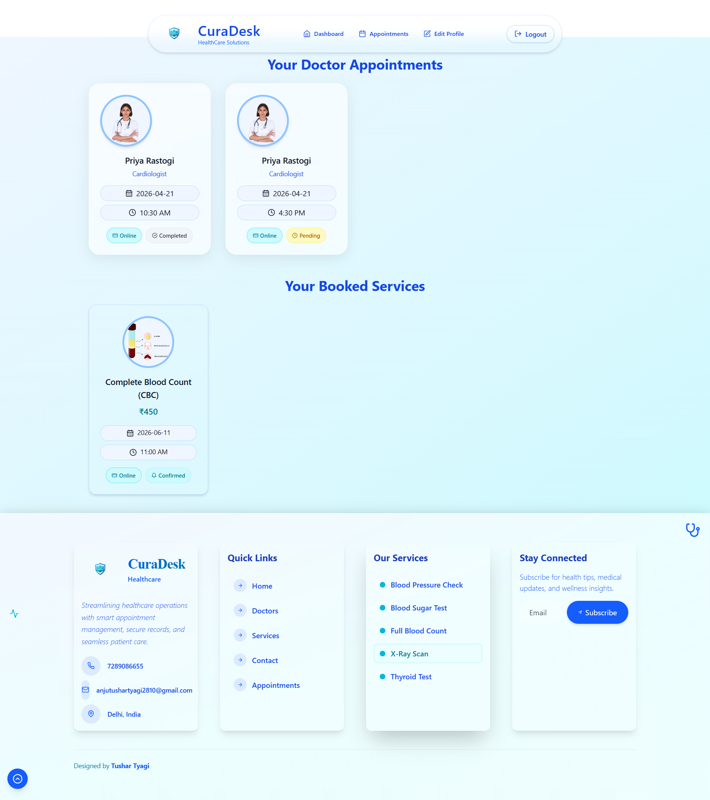
<br/>
<b>Appointment History</b><br/>
Track past and upcoming bookings

</td>

<td align="center">

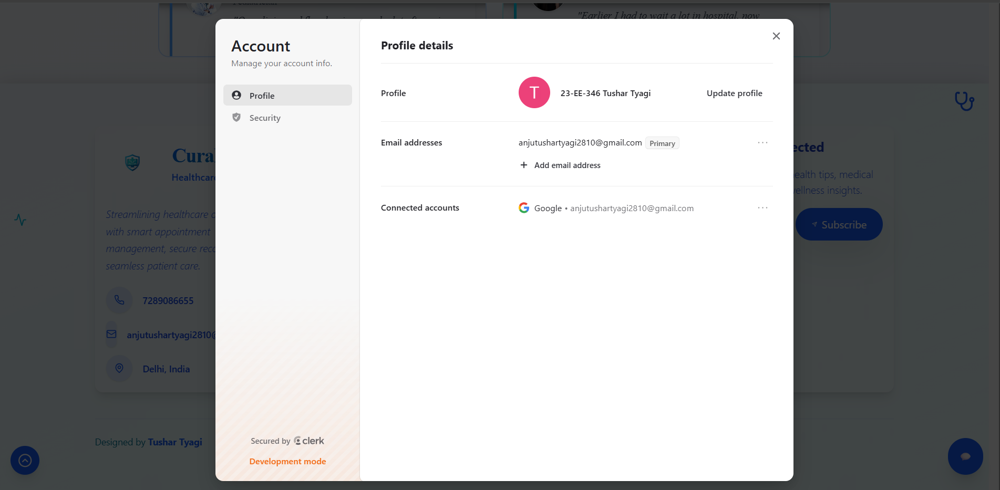
<br/>
<b>User Profile</b><br/>
Manage personal details and records

</td>
</tr>
</table>

---

### 🩺 Doctor Panel

<table>
<tr>
<td align="center">

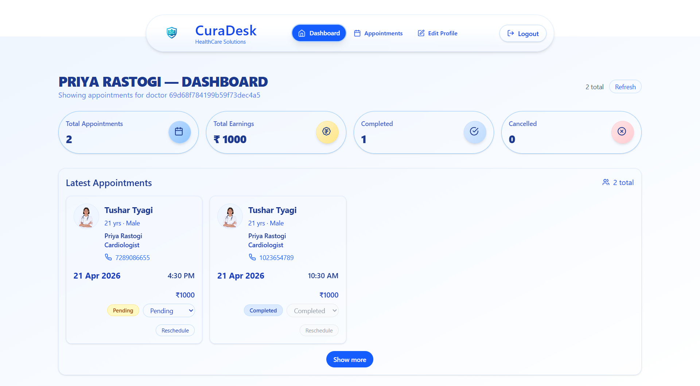
<br/>
<b>Doctor Dashboard</b><br/>
View and manage assigned appointments

</td>

<td align="center">

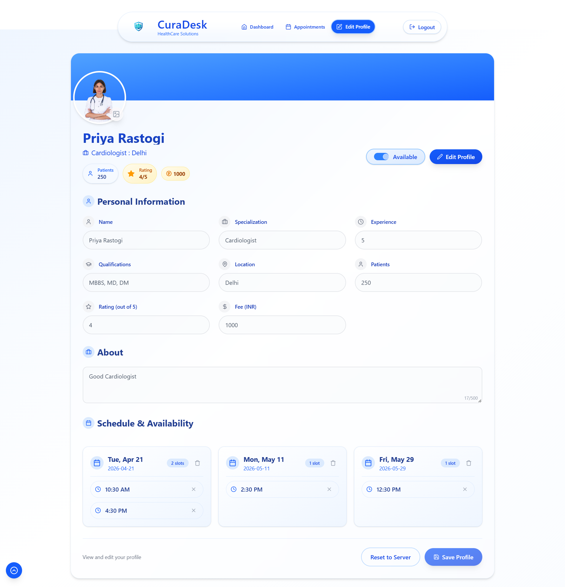
<br/>
<b>Doctor Profile Management</b><br/>
Update profile status and manage patient interactions

</td>
</tr>
</table>

---

### 🌗 Admin Dashboard (Light vs Dark Mode)

<table>
<tr>
<td align="center">

<b>🌞 Light Mode</b><br/>
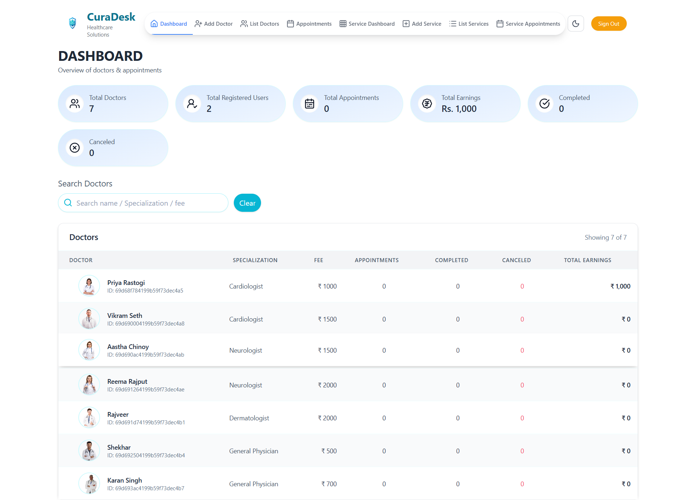

</td>

<td align="center">

<b>🌙 Dark Mode</b><br/>
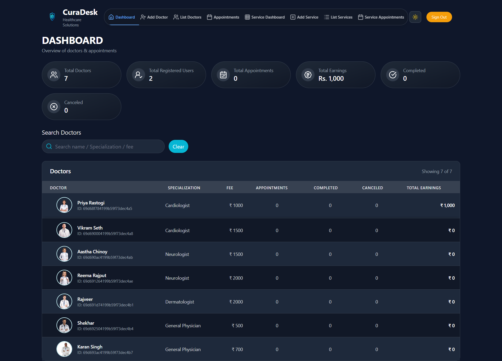

</td>
</tr>
</table>

Dark mode is implemented in the admin panel to enhance usability during extended operational workflows.

---

### 👨‍💼 Admin Controls

<table>
<tr>
<td align="center">

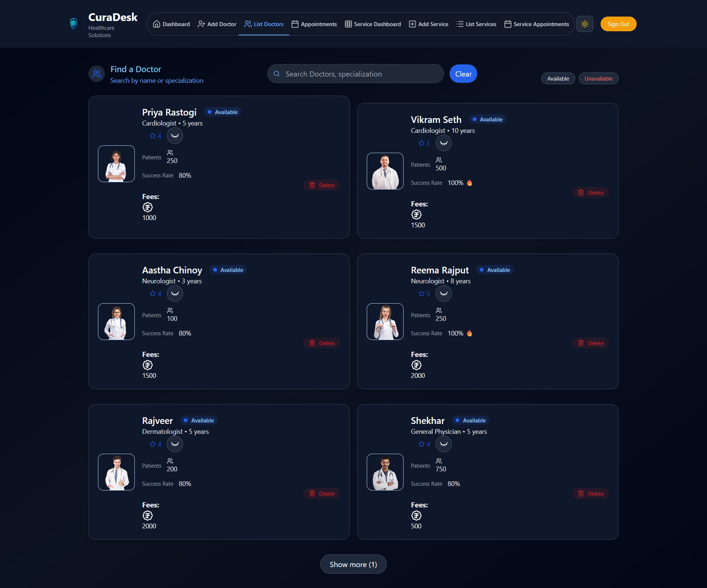
<br/>
<b>Doctor Management</b><br/>
Add, edit, and manage doctors

</td>

<td align="center">

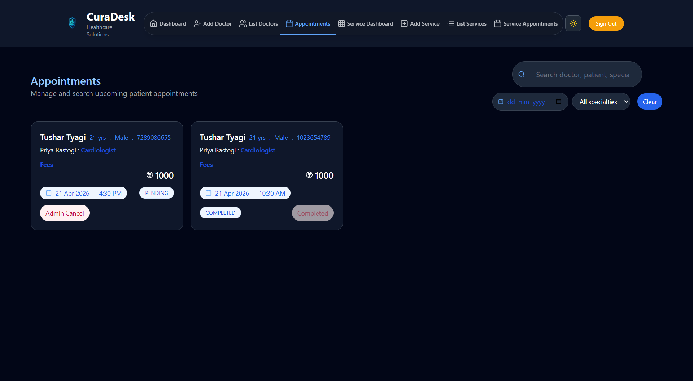
<br/>
<b>Doctor Appointment Management</b><br/>
Update statuses and manage bookings for Doctors

</td>
</tr>

<tr>
<td align="center">

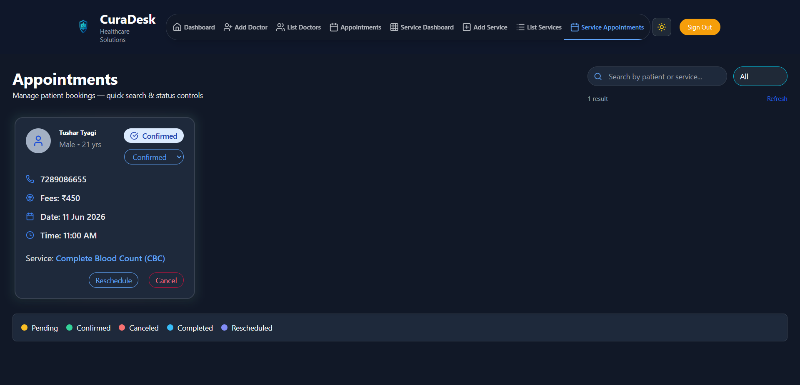
<br/>
<b>Service Appointment Management</b><br/>
Update statuses and manage bookings for Services

</td>

<td align="center">

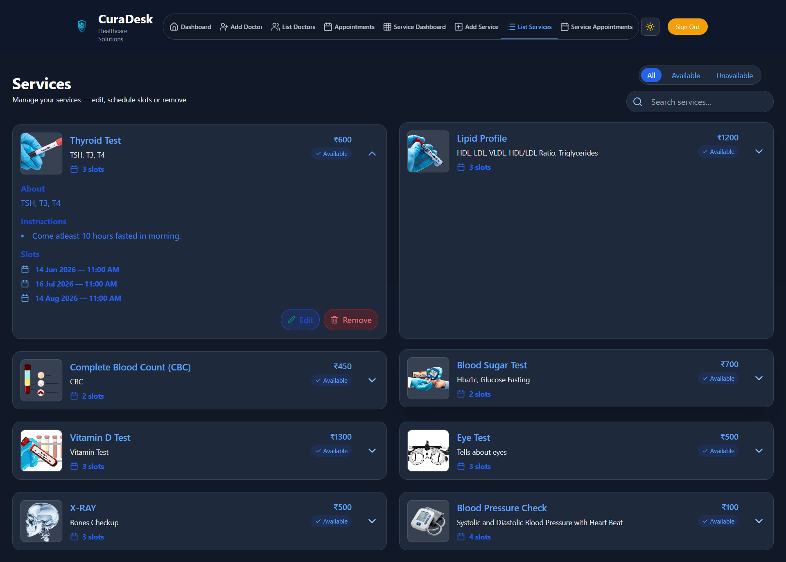
<br/>
<b>Service Management</b><br/>
Manage available hospital services

</td>
</tr>
</table>

## 🌟 Future Roadmap

- 📊 Dashboard analytics
- 📱 Full dark mode support
- 📩 SMS / WhatsApp notifications
- 🏥 Multi-hospital support
- 💬 Doctor–Patient chat system
- 🧠 LangChain orchestration
- ⚡ FastAPI AI microservices
- 🔬 Advanced medical NLP
- 🤖 Dedicated AI chatbot page

## 💼 Portfolio Highlights

CuraDesk AI demonstrates:

- Full Stack MERN Development
- AI + RAG Engineering
- OCR & Document Intelligence
- Vector Databases
- Secure Authentication
- Payment Integration
- Healthcare Workflow Design
- Conversational AI Systems


## 📌 Learning Outcomes

-	Built a complete MERN stack application from scratch
-	Implemented role-based access control & secure APIs
-	Integrated Stripe payments, Cloudinary, and email services
-	Improved skills in system design, UI/UX, and scalability
-   Built a complete Retrieval-Augmented Generation (RAG) pipeline
-   Implemented vector embeddings & semantic search
-   Integrated Dockerized AI infrastructure
-   Worked with Redis caching and ChromaDB vector storage
-   Developed AI-powered document understanding system

<p align="center">
  
</p>


