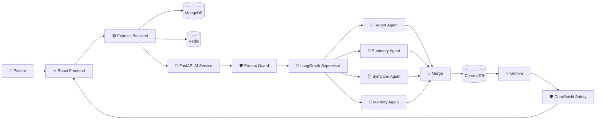

<p align="center">
  
</p>

<p align="center">
  
</p>

# CuraDesk AI – Intelligent Healthcare Assistant & Hospital Management System

## 🏥 About CuraDesk AI
CuraDesk AI is an intelligent healthcare platform built on the MERN stack that combines a complete Hospital Management System with an AI-powered healthcare assistant.

The platform provides role-based dashboards for Admins, Doctors, and Patients while integrating Retrieval-Augmented Generation (RAG), LangGraph multi-agent orchestration, OCR-based medical report understanding, semantic search, conversational memory, AI symptom triage, doctor recommendation, and an AI safety layer called CuraShield.

CuraDesk AI demonstrates production-inspired AI architecture for healthcare applications with secure authentication, payment processing, vector databases, Redis caching, and AI guardrails.

## 💡 Why CuraDesk AI?

Unlike traditional hospital management systems, CuraDesk combines administrative workflows with AI-assisted healthcare.

Patients can:

- Upload medical reports
- Ask contextual questions about reports
- Receive AI-generated summaries
- Perform symptom triage
- Get doctor recommendations
- Book appointments instantly
- Receive AI safety warnings for critical symptoms

The project demonstrates how Large Language Models can be safely integrated into healthcare applications using RAG, LangGraph orchestration, Redis memory, and AI guardrails.

## 🎯 Key Engineering Highlights

- 🔐 Clerk-based authentication with complete user data isolation
- 🧠 LangGraph multi-agent AI orchestration
- 📄 Retrieval-Augmented Generation (RAG) for medical reports
- 📑 Automatic OCR document processing
- 🧩 SHA-256 duplicate report detection
- ♻️ Automatic embedding reuse
- 🛡️ CuraShield AI safety layer
- 🚫 Prompt injection protection
- ⚡ Dead-end embedding recovery
- 💬 Redis-powered conversational memory
- 💳 Stripe payment workflows
- 📧 Automated booking confirmation with invoice generation
- 🐳 Dockerized Redis & ChromaDB infrastructure

<p align="center">


</p>

## 🏗️ CuraDesk - Complete System Architecture

```mermaid
flowchart LR

%% =====================================================
%% USERS
%% =====================================================

PATIENT["🧑 Patient"]
DOCTOR["🩺 Doctor"]
ADMIN["👨‍💼 Admin"]

%% =====================================================
%% FRONTENDS
%% =====================================================

PATIENT --> FRONTEND["⚛️ Patient Portal (React + Vite)"]
DOCTOR --> FRONTEND
ADMIN --> ADMINAPP["⚛️ Admin Dashboard (React + Vite)"]

%% =====================================================
%% AUTHENTICATION & SECURITY
%% =====================================================

FRONTEND --> CLERK["🔐 Clerk Authentication"]
ADMINAPP --> CLERK

CLERK --> EXPRESS["🟢 Express Backend"]

EXPRESS --> RBAC["Role-Based Access Control"]

RBAC --> PATIENTDATA["Patient APIs"]
RBAC --> DOCTORDATA["Doctor APIs"]
RBAC --> ADMINDATA["Admin APIs"]

%% =====================================================
%% DATABASE
%% =====================================================

EXPRESS --> MONGO[("🍃 MongoDB")]

MONGO --> USERS["Users"]
MONGO --> DOCTORS["Doctors"]
MONGO --> APPOINTMENTS["Appointments"]
MONGO --> SERVICES["Healthcare Services"]
MONGO --> REPORTS["Medical Reports"]
MONGO --> CHATSESSIONS["Chat Sessions"]
MONGO --> MESSAGES["Messages"]
MONGO --> METADATA["Embedding Metadata"]

%% =====================================================
%% USER DATA ISOLATION
%% =====================================================

CLERK --> USERID["Unique Clerk User ID"]

USERID --> CHATSESSIONS

USERID --> REPORTS

USERID --> APPOINTMENTS

USERID --> SERVICES

%% =====================================================
%% APPOINTMENT BOOKING
%% =====================================================

PATIENTDATA --> BOOK["Doctor Appointment Booking"]

BOOK --> STRIPE["💳 Stripe Payment"]

STRIPE --> CONFIRM["Booking Confirmation"]

CONFIRM --> EMAIL["📧 Email Notification"]

EMAIL --> MAIL["Doctor Name<br/>Appointment Slot<br/>Invoice<br/>Booking Confirmation"]

MAIL --> PATIENT

%% =====================================================
%% SERVICE BOOKING
%% =====================================================

PATIENTDATA --> SERVICEBOOK["Healthcare Service Booking"]

SERVICEBOOK --> STRIPE

%% =====================================================
%% ADMIN FEATURES
%% =====================================================

ADMINDATA --> MANAGEDOC["Manage Doctors"]

ADMINDATA --> MANAGESERVICE["Manage Services"]

ADMINDATA --> MANAGEBOOK["Manage Appointments"]

ADMINDATA --> ANALYTICS["Dashboard Analytics"]

%% =====================================================
%% AI CHAT ENTRY
%% =====================================================

FRONTEND --> CHATBOT["🤖 CuraDesk AI"]

CHATBOT --> CHATCTRL["AI Controller"]

CHATCTRL --> FASTAPI["🐍 FastAPI AI Service"]

%% =====================================================
%% CURASHIELD
%% =====================================================

FASTAPI --> PROMPT["🛡️ CuraShield Prompt Guard"]

PROMPT --> ROUTER["🧠 LangGraph Hybrid Router"]

%% =====================================================
%% LANGGRAPH AGENTS
%% =====================================================

ROUTER --> REPORT["📄 Report Agent"]

ROUTER --> SUMMARY["📝 Summary Agent"]

ROUTER --> SYMPTOM["🩺 Symptom Agent"]

ROUTER --> MEMORY["💬 Memory Agent"]

%% =====================================================
%% REPORT PROCESSING
%% =====================================================

REPORT --> HASH["SHA-256 Report Hash"]

HASH --> DUP{"Duplicate Report?"}

DUP -- Yes --> META

DUP -- No --> OCR

OCR["📄 Tesseract OCR"]

OCR --> CLEAN["Text Cleaning"]

CLEAN --> CHUNK["Semantic Chunking"]

CHUNK --> META

%% =====================================================
%% EMBEDDING MANAGEMENT
%% =====================================================

META --> EXISTS{"Embeddings Exist?"}

EXISTS -- Yes --> CHROMA

EXISTS -- No --> DEADEND{"Metadata Exists?"}

DEADEND -- Yes --> REBUILD["Dead-End Protection<br/>Regenerate Missing Embeddings"]

DEADEND -- No --> EMBED

REBUILD --> EMBED["Gemini Embeddings"]

EMBED --> CHROMA[("🧠 ChromaDB")]

%% =====================================================
%% RAG
%% =====================================================

REPORT --> CHROMA

CHROMA --> RETRIEVE["Semantic Retrieval"]

RETRIEVE --> RAG["Retrieval-Augmented Generation"]

%% =====================================================
%% MEMORY
%% =====================================================

MEMORY --> REDIS[("⚡ Redis Memory")]

REDIS --> HISTORY["Conversation History"]

HISTORY --> CHATSESSIONS

%% =====================================================
%% SYMPTOM TRIAGE
%% =====================================================

SYMPTOM --> TRIAGE["AI Symptom Analysis"]

TRIAGE --> SPECIALIST["Specialist Recommendation"]

SPECIALIST --> FINDDOC["Doctor Matching"]

FINDDOC --> DOCTORS

%% =====================================================
%% SUMMARY
%% =====================================================

SUMMARY --> REPORTSUMMARY["Medical Report Summary"]

%% =====================================================
%% RESPONSE MERGING
%% =====================================================

REPORT --> MERGE["🔀 Merge AI Responses"]

SUMMARY --> MERGE

SYMPTOM --> MERGE

MEMORY --> MERGE

%% =====================================================
%% CURASHIELD SAFETY
%% =====================================================

MERGE --> SAFETY["🛡️ CuraShield Medical Safety"]

SAFETY --> RISK["Risk Level<br/>Severity Score<br/>Urgent Care Detection"]

RISK --> RESPONSE["🤖 Final AI Response"]

RESPONSE --> CHATBOT

%% =====================================================
%% OBSERVABILITY
%% =====================================================

EXPRESS --> LANGSMITH["📊 LangSmith Tracing (Optional)"]

FASTAPI --> LANGSMITH
```



## 🚀 Features

👨‍💼 Admin Panel

-	Add, edit, and manage doctors & services
-	View, reschedule, or cancel appointments
-	Update appointment status (Pending, Confirmed, Completed, Cancelled)
-	Track earnings and bookings
-	Dark mode enabled dashboard 🌙

 🩺 Doctor Panel

-	View assigned appointments
-	Update appointment status
-	Manage patient interactions

 🧑 Patient Panel

-  Register/Login securely (Clerk Auth)
-  Book appointments with doctors/services
-  View appointment history
-  🤖 AI Healthcare Assistant with symptom triage, medical report analysis, RAG, and doctor recommendations
-  📄 AI Medical Report Upload & Analysis
-  🧠 RAG-based Medical Report Question Answering
-  🔍 Semantic Search using Vector Embeddings

## 🤖 AI Features

- 🧠 LangGraph Multi-Agent Architecture
- 📄 OCR-based Medical Report Processing
- 🔍 ChromaDB Semantic Search
- 🧩 Retrieval-Augmented Generation (RAG)
- 💬 Conversational Memory using Redis
- 🩺 AI Symptom Triage
- 👨‍⚕️ Intelligent Doctor Recommendation
- 📋 Medical Report Summarization
- ⚡ Hybrid Agent Routing
- 🛡️ CuraShield AI Safety Layer
- 🚫 Prompt Injection Protection
- ⚠️ AI Risk Classification

## 🛡️ CuraShield AI Safety Layer

CuraShield is the AI safety framework integrated into CuraDesk AI to improve reliability and secure healthcare interactions.

Features:

- Prompt Injection Detection
- Medical Risk Classification
- Emergency Case Identification
- AI Safety Monitoring
- Security-aware Response Pipeline
- Low-latency Rule-based Prompt Protection

## ⚙️ AI Microservice & Optimizations

CuraDesk separates AI workloads into an independent FastAPI service.

Responsibilities:

- Prompt Injection Detection
- Medical Safety Classification
- Symptom Triage
- OCR Processing
- Medical Report Understanding
- LangGraph Agent Orchestration
- RAG Response Generation

This separation keeps the MERN backend lightweight while allowing the AI layer to scale independently.

Optimizations:

- SHA-256 duplicate report detection
- Report hash reuse
- Embedding reuse
- Automatic dead-end embedding recovery
- Metadata consistency checks
- Redis conversational memory
- Hybrid LangGraph routing
- Cached vector retrieval
- Isolated chat sessions
- Clerk-based user data isolation
- Prompt injection guard
- Low-latency safety pipeline

## 🏗️ CuraDesk AI Architecture



## 🛠️ Tech Stack

 Frontend:

-	React.js (Vite)
-	Tailwind CSS
-	Context API

 Backend:

-	Node.js
-	Express.js

 Database:

-	MongoDB (Mongoose)

 Authentication:

-	Clerk

 Integrations:

-	Stripe (Payments)
-	Cloudinary (Image Uploads)
-	Nodemailer (Emails)
-   Tesseract OCR (Offline OCR Engine)
-   Docker (Redis + ChromaDB Containers)

AI Stack

- Gemini
- LangGraph
- LangChain
- ChromaDB
- Redis
- FastAPI
- Tesseract OCR

## 📦 Project Structure

```bash
CuraDesk/
│
├── admin/                     # React Admin Dashboard
│   ├── public/
│   └── src/
│       ├── components/
│       ├── context/
│       ├── pages/
│       └── assets/
│
├── frontend/                  # Patient & Doctor Portal
│   ├── public/
│   └── src/
│       ├── components/
│       ├── doctor/
│       ├── pages/
│       ├── assets/
│       └── App.jsx
│
├── backend/                   # Express API
│   ├── config/
│   ├── controllers/
│   ├── middlewares/
│   ├── models/
│   ├── routes/
│   ├── services/
│   ├── utilities/
│   └── server.js
│
├── ai-service/                # FastAPI AI Microservice
│   ├── main.py
│   ├── .env
│   └── venv/
│
├── screenshots/
├── docker-compose.yml
└── README.md
```


## ⚙️ Installation & Setup

 1️⃣ Clone Repository
```bash
	git clone https://github.com/tyagi1tushar/curadesk-hospital-management-system.git
	
	cd hospital-management-system
```
 2️⃣ Backend Setup
```bash
	cd backend
	
	npm install
```
Create .env file:
```bash
	JWT_SECRET=your_jwt_secret
	FRONTEND_URL=frontend_url
	MONGO_URI=your_mongodb_uri
	CLERK_SECRET_KEY=your_clerk_secret
	STRIPE_SECRET_KEY=your_stripe_secret
	CLOUDINARY_CLOUD_NAME=your_cloud_name
	CLOUDINARY_API_KEY=your_api_key
	CLOUDINARY_API_SECRET=your_api_secret
	EMAIL_USER=your_email
	EMAIL_PASS=your_email_app_password
	GEMINI_API_KEY=your_gemini_api_key
	REDIS_URL=your_redis_url

	# Optional - AI Observability
	LANGSMITH_TRACING=true
	LANGSMITH_ENDPOINT=your_endpoint
	LANGSMITH_API_KEY=your_langsmith_api_key
	LANGSMITH_PROJECT=CURADESKAI
```
Run backend:
```bash
	npm start
```
 2️⃣ Start AI Infrastructure

 Make sure Docker Desktop is running.

Run:

```bash
docker-compose up 
```
In ai-service folder terminal,

Create a .env file,

```bash
GEMINI_API_KEY=your_gemini_api_key
```
Run:

```bash
venv\Scripts\activate
uvicorn main:app --reload --port 8001
```

 3️⃣ Frontend Setup

Patient/Doctor Frontend
```bash
	cd frontend
	npm install
	npm run dev
```
Admin Panel
```bash
	cd admin
	npm install
	npm run dev
```
## 🔄 Workflow Overview

1.	Patient selects doctor/service
2.	Books appointment
3.	Completes Stripe payment
4.	Appointment automatically marked as Confirmed
5.	Email notification sent to patient

## 🤖 AI Report Workflow

1. User uploads a medical report (PDF/Image)
2. OCR extracts report text (Tesseract)
3. Text is cleaned and preprocessed
4. Report is split into semantic chunks
5. Embeddings are generated using Gemini
6. Embeddings are stored in ChromaDB
7. Report hash is checked to reuse existing embeddings when possible
8. User asks questions about the report
9. Relevant chunks are retrieved from ChromaDB
10. LangGraph routes the request to the appropriate AI agent
11. Gemini generates a context-aware response using RAG
12. CuraShield performs medical safety classification
13. Final response is returned with retrieved context

## 📸 Screenshots

### 🧑‍💻 User Experience

<table>
<tr>
<td align="center">


<br/>
<b>User Dashboard</b><br/>
Overview of user activity and appointments

</td>

<td align="center">


<br/>
<b>Booking System</b><br/>
Book appointments with doctors/services

</td>
</tr>

<tr>
<td align="center">


<br/>
<b>Payment Flow</b><br/>
Secure Stripe checkout experience

</td>

<td align="center">


<br/>
<b>AI Chatbot</b><br/>
Helps users discover suitable doctors

</td>
</tr>

<tr>
<td align="center">


<br/>
<b>Appointment History</b><br/>
Track past and upcoming bookings

</td>

<td align="center">


<br/>
<b>User Profile</b><br/>
Manage personal details and records

</td>
</tr>
</table>

---

### 🩺 Doctor Panel

<table>
<tr>
<td align="center">


<br/>
<b>Doctor Dashboard</b><br/>
View and manage assigned appointments

</td>

<td align="center">


<br/>
<b>Doctor Profile Management</b><br/>
Update profile status and manage patient interactions

</td>
</tr>
</table>

---

### 🌗 Admin Dashboard (Light vs Dark Mode)

<table>
<tr>
<td align="center">

<b>🌞 Light Mode</b><br/>


</td>

<td align="center">

<b>🌙 Dark Mode</b><br/>


</td>
</tr>
</table>

Dark mode is implemented in the admin panel to enhance usability during extended operational workflows.

---

### 👨‍💼 Admin Controls

<table>
<tr>
<td align="center">


<br/>
<b>Doctor Management</b><br/>
Add, edit, and manage doctors

</td>

<td align="center">


<br/>
<b>Doctor Appointment Management</b><br/>
Update statuses and manage bookings for Doctors

</td>
</tr>

<tr>
<td align="center">


<br/>
<b>Service Appointment Management</b><br/>
Update statuses and manage bookings for Services

</td>

<td align="center">


<br/>
<b>Service Management</b><br/>
Manage available hospital services

</td>
</tr>
</table>

## 🌟 Future Roadmap

- 📩 SMS / WhatsApp notifications
- 🏥 Multi-hospital support
- 💬 Doctor–Patient chat system
- AI Observability Dashboard
- AI Payment Operations
- Medical Knowledge Graph
- Voice-enabled AI Assistant
- AI Appointment Copilot
- Multi-modal Medical AI
- 🔬 Advanced medical NLP
- 🤖 Dedicated AI chatbot page

## 💼 Portfolio Highlights

CuraDesk AI demonstrates experience with:

- Full Stack MERN Development
- Healthcare AI Systems
- LangGraph Multi-Agent Architecture
- Retrieval-Augmented Generation (RAG)
- Vector Databases (ChromaDB)
- FastAPI AI Microservices
- AI Safety Engineering
- Prompt Injection Protection
- Conversational Memory Systems
- OCR Document Intelligence
- Redis Caching
- Stripe Payment Integration
- Clerk Authentication
- Dockerized AI Infrastructure

## 📌 Learning Outcomes

-	Built a complete MERN stack application from scratch
-	Implemented role-based access control & secure APIs
-	Integrated Stripe payments, Cloudinary, and email services
-	Improved skills in system design, UI/UX, and scalability
-   Designed production-inspired AI healthcare workflows using LangGraph, RAG, Redis, ChromaDB, OCR, and FastAPI microservices.
-   Built conversational AI with Redis-based memory, LangGraph multi-agent orchestration, and Retrieval-Augmented Generation     (RAG).

<p align="center">
  
</p>


